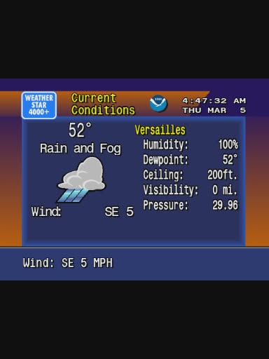
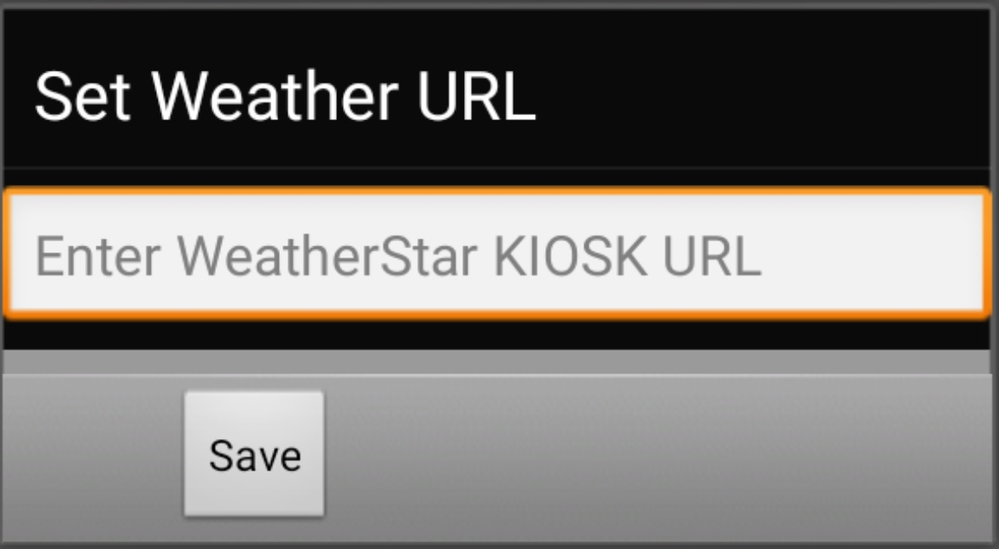

# CAT-S22-WeatherStar4000
android web wrapper for [NetByMatt's WeatherStar400 web port](https://github.com/netbymatt/ws4kp), designed for CAT S22 Flip's external display 

##Installation
build using [Android Studio](https://developer.android.com/studio) API 30 (android 11) or try esperimental debug apk in releases (will prompt for KIOSK URL on first launch, clear app data to reset url)

-get [KIOSK permashare URL](https://github.com/netbymatt/ws4kp?tab=readme-ov-file#kiosk-mode) from [NetByMatt's WeatherStar400 web port or selfhosted url](https://github.com/netbymatt/ws4kp)

